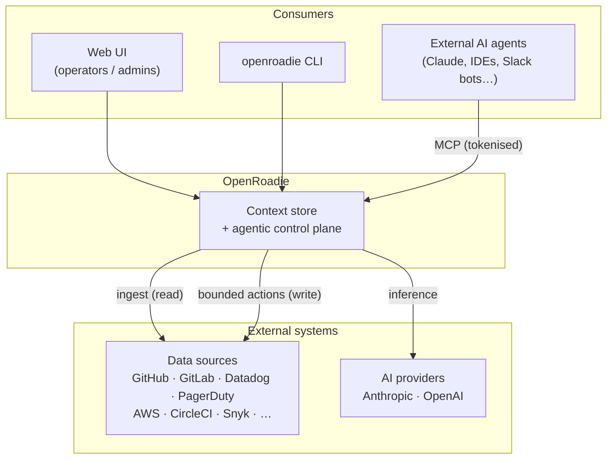
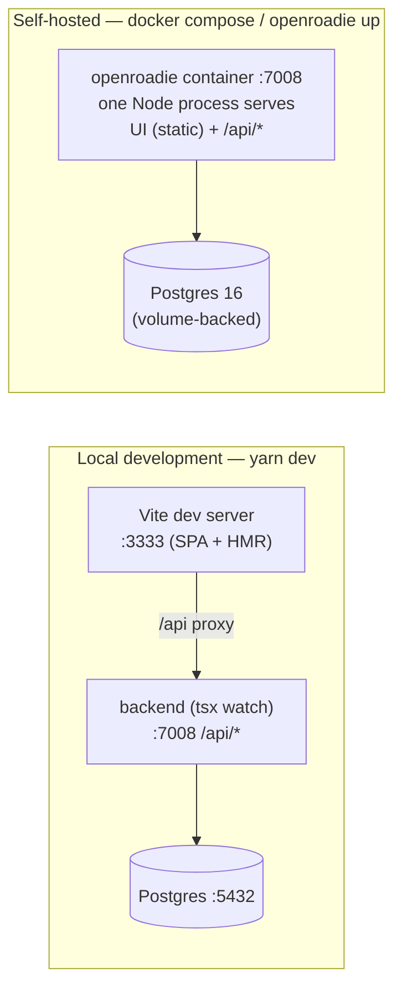
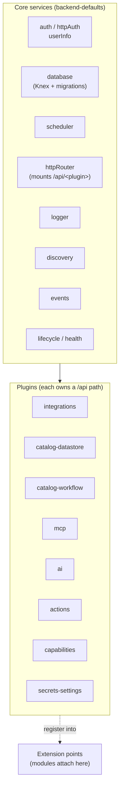
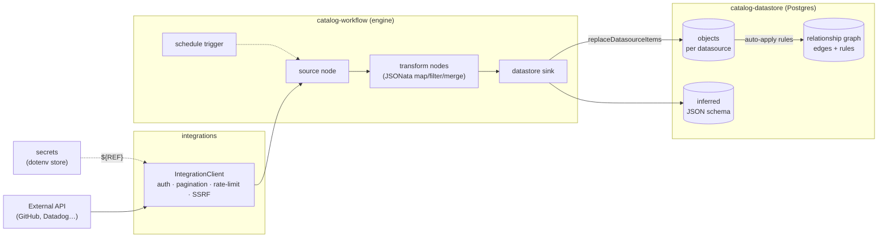
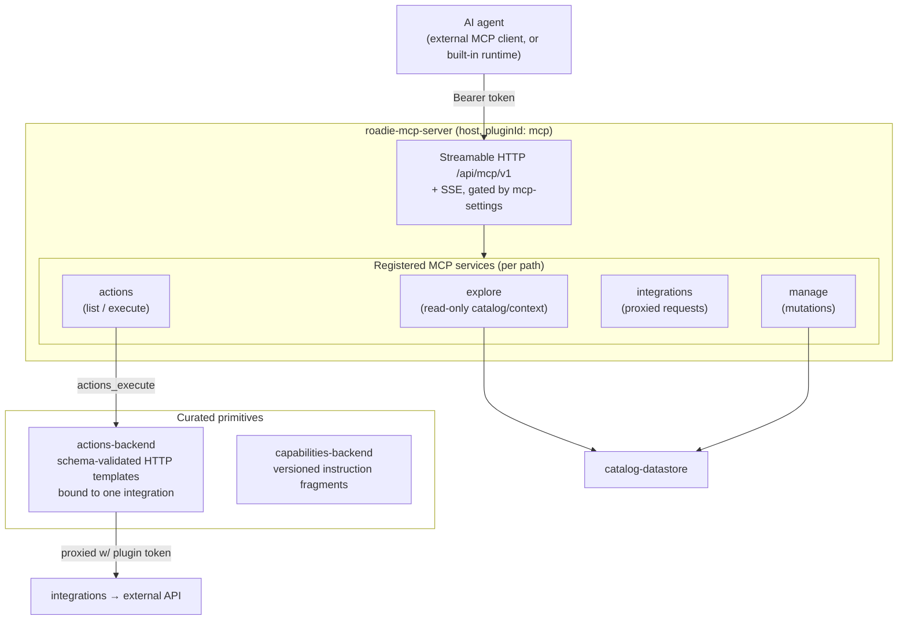
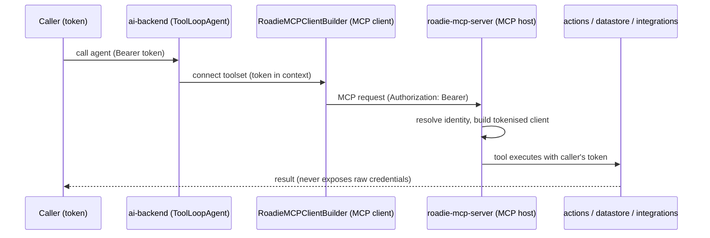

# OpenRoadie Architecture

OpenRoadie is a self-hosted **context store** and **agentic control platform**. It ingests
organisational metadata about your software into an always-on context layer, lets you build
guardrails around the actions an agent may take, and exposes the whole thing to agents through
tokenised [MCP](https://modelcontextprotocol.io) servers.

This document explains how the system is put together, working from the outside in: the system in
context, how it runs, how the backend is composed, the two planes it is built around — the **data
plane** (getting context in) and the **control plane** (letting agents act on it) — and finally the
frontend and workspace layout.

> **Heritage.** OpenRoadie grew out of a long-running project inside [Roadie](https://roadie.io),
> which was itself built on Spotify's [Backstage](https://backstage.io). It inherits Backstage's
> "New Backend System" — a dependency-injection runtime of composable plugins and service factories.
> If you know Backstage, `createBackendPlugin` / `createBackendModule` / `createServiceFactory` will
> look familiar.

---

## 1. System context

At the highest level, OpenRoadie sits between three things: the people and agents that query it, the
external systems it draws context from, and the AI providers that power its own agents.



- **Consumers** talk to one HTTP surface. The UI and CLI manage configuration; agents connect over
  MCP and are handed only the tools they are permitted to use.
- **Data sources** are read during ingestion and written to — narrowly — through curated _actions_.
- **AI providers** back the built-in agent runtime; keys are stored as secrets.

---

## 2. Runtime & deployment topology

OpenRoadie is a single Node.js backend plus a Postgres database. The React frontend is a static
bundle. How those pieces are served depends on how you run it.



- **Development** (`yarn dev`) runs the backend (`:7008`) and the Vite SPA (`:3333`) as two processes,
  concurrently. The frontend is code-split and hot-reloaded; API calls go to the backend's `/api`.
- **Self-hosted** builds a single image (`Dockerfile`). The backend serves the pre-built SPA _and_
  the API from one origin/port — when `OPENROADIE_WEB_DIR` is set, `serveFrontend` mounts the static
  bundle behind the plugin routers so `/api/*` is never shadowed. `docker-compose.yml` pairs it with
  Postgres 16 on a persistent volume.
- The **`@roadiehq/openroadie-cli`** (`openroadie` binary) drives the lifecycle from zero to a live,
  agent-queryable catalog: `openroadie up` (build/pull image + `docker compose up`), then `connect`,
  `secret`, `integrations`, `sources`, `index-catalog`, `relationships`, `capabilities`, `query`, and
  `token`. It pins the image tag to its own version so the running server matches the CLI.

**State.** Everything persists to **one Postgres database**. Each plugin owns its own Knex
migrations (co-located under `plugins/*/migrations/`), so schema is modular but the datastore is
shared.

---

## 3. Backend composition

The backend is not a monolith with a router file — it is a set of **plugins** and **service
factories** wired together by a dependency-injection container. `packages/backend/src/index.ts` is
the entire assembly:

```ts
const backend = createRoadieBackend(/* mount raw express middleware */);

backend.add(aiServiceFactory);
backend.add(secretsMetadataServiceFactory);
backend.add(import('@roadiehq/integrations-backend'));
backend.add(import('@roadiehq/catalog-datastore-backend'));
backend.add(import('@roadiehq/roadie-mcp-server'));
backend.add(import('@roadiehq/mcp-catalog-datastore-module'));
backend.add(import('@roadiehq/ai-backend'));
backend.add(import('@roadiehq/catalog-workflow-backend'));
backend.add(import('@roadiehq/secrets-settings-backend'));
backend.add(import('@roadiehq/capabilities-backend'));
backend.add(import('@roadiehq/actions-backend'));
backend.add(import('@roadiehq/mcp-actions-module'));
backend.start();
```

### The framework

`packages/backend-defaults` (`createRoadieBackend`) and `packages/extensions-api` provide the
runtime. `extensions-api` exports the Backstage-style primitives — `createBackendPlugin`,
`createBackendModule`, `createServiceFactory`, `createServiceRef`, `coreServices`, `BackendFeature`.
`createRoadieBackend` seeds a `createSpecializedBackend` with the **core service factories** every
plugin can depend on:



- A **`ServiceRegistry` + `DependencyGraph`** resolve the order in which factories and plugins
  initialise; the HTTP router mounts each plugin under `/api/<pluginId>`.
- **Plugins** own a domain and a route path. **Modules** (e.g. `mcp-catalog-datastore-module`,
  `mcp-actions-module`) don't own a path — they attach into another plugin's **extension point**.
  This is how the MCP host stays generic while other plugins contribute tools to it (see §5).
- Load order matters: hosts (`roadie-mcp-server`, `ai-backend`) register their extension points
  first; modules attach into them at init.

The rest of this document groups these plugins into the two planes they form.

---

## 4. Data plane — building the context store

The data plane answers _"how does organisational metadata get in and become a queryable graph?"_
It is a one-directional pipeline:



### Integrations — the connector layer

`integrations-backend` / `integrations-node` are a generic client for external APIs. An
`IntegrationClient` resolves a stored integration config and issues requests through pluggable
**backends**: HTTP (auth types: header / basic / bearer / OAuth2 client-credentials / OAuth2
JWT-bearer; cursor/page/offset/link-header pagination, including offset params in query strings or
POST JSON bodies; GraphQL handling) and AWS (SigV4). It
substitutes `${SECRET}` references on the request hot path, mints GitHub App tokens, rate-limits via
a Postgres-backed limiter, and blocks private-network egress (SSRF guard).

### Workflows — the ingestion engine

A **workflow** is a small DAG (one workflow = one datasource; `datasourceId === workflowId`). Nodes
come in four kinds: **sources** (pull from an integration, page by page), **transforms** (JSONata
`map` / `filter` / `merge`), **triggers** (cron schedule), and a **sink** (write to the datastore).
`PagedWorkflowExecutor` topologically sorts the DAG, runs independent nodes in parallel, streams
execution events (SSE), and resolves per-node secret references before running. Nodes exchange data
as pages through a Postgres staging plane rather than in memory, so a run's heap stays bounded
whatever the dataset size. A `ScheduleDispatcher` polls due
schedules and claims them with a DB-backed lease, so in a multi-replica deployment only one instance
runs a given schedule (leader election).

### Datastore — objects, schemas, and the graph

`catalog-datastore-backend` stores **arbitrary JSON objects grouped by datasource**:

- **Objects** — one row per object keyed by `(datasource_id, object_id)`, with the JSON payload and a
  pointer to its schema. Written in bulk via `replaceDatasourceItems`.
- **Inferred schemas** — a JSON Schema is inferred from ingested objects (with a content hash for
  change detection); no schema is declared up front.
- **Full-text search** — a Postgres `plpgsql` function flattens each object into a generated
  `search_text` column indexed with a `pg_trgm` GIN index for substring matching.
- **Relationships (the knowledge graph)** — directed edges between objects, stored in
  `datastore_relation`.

**Edges are produced by a rules engine.** A _relationship rule_ is declarative — source/target
datasources plus JSONata field expressions and a `relation_type`. Two strategies:

- **field-matching** — evaluate source & target field expressions over the rows and match them
  (exact/fuzzy). Re-runs replace the rule's prior edges atomically under an advisory lock, so
  application is idempotent.
- **integration-backed** — for each source object, call an external integration and match its
  response to a target object.

When a datasource is refreshed, `replaceDatasourceItems` schedules rule re-application through an
`AutoApplyCoalescer` that debounces bursty refreshes into one run. Rules are grouped into
**relationship layers** (colored logical views of the graph). New rules can be proposed by
**suggestion producers** — the built-in deterministic `api` producer (field profiling → candidate
filtering → fuzzy comparison → scoring) and an optional `splink` producer — which emit rules in a
`suggested` state for a human to review and activate.

---

## 5. Control plane — the agentic layer

The control plane answers _"how do agents act on the context, safely?"_ It has four cooperating
pieces: **actions** and **capabilities** (the curated primitives), the **MCP host** (how they're
exposed), and the **AI runtime** (the built-in agent that consumes them).



### Actions — the guardrailed write primitive

An **action** (`actions-backend` / `actions-common`) is a stored, parameterised HTTP-request template
**bound to a single integration**. It is the unit that turns "an arbitrary integration" into "a
narrow, admin-curated capability." Guardrails are enforced at execution:

- Inputs are validated against a JSON Schema compiled from the action's parameters (Ajv).
- Path tokens are URL-encoded and the body is rendered as JSON, so string inputs can't escape the
  template.
- The action can only hit the one integration it's bound to; the request is proxied to
  `integrations-backend` with a plugin service token, so **raw credentials never reach the model**.
- Actions are versioned (append-only, with restore), and `actions_execute` requires the action to be
  `enabled`.

**Capabilities** (`capabilities-backend`) are the read-side counterpart: named, versioned instruction
fragments (curated prompt/skill descriptions) that agents can discover and apply.

### MCP host — tokenised, per-request servers

`roadie-mcp-server` (`pluginId: mcp`) is a generic **MCP host**. It mounts a Streamable HTTP transport
at `/api/mcp/v1` (plus SSE) and holds a map of named **MCP services**, each on its own path. Modules
contribute services through the host's extension point:

- `mcp-catalog-datastore-module` registers **`explore`** (read-only catalog/capability/context tools),
  **`integrations`** (proxied external requests), and **`manage`** (mutations) — grouped by risk.
- `mcp-actions-module` registers **`actions`** (`actions_list`, `actions_execute`).

The defining property is that these are **tokenised**: on every JSON-RPC request the host reads the
caller's bearer token, resolves their identity, and builds a _pre-permissioned_ fetch client that
closes over that token. That client is injected into every tool call, so any downstream HTTP call a
tool makes reuses the caller's credentials — **tools run with the caller's permissions, not a service
account**. `mcp-settings-backend` gates which servers and tools are enabled at request time, and
every tool call is wrapped for metrics and audit-sink emission (with sensitive-value redaction).

### AI runtime — the built-in agent

`ai-backend` / `ai-node` are the in-repo agent runtime, built on the **AI SDK v5**. It exposes three
registries — **agents**, **toolsets**, and **models** (tiered `large`/`medium`/`small`, mapped to
concrete Anthropic/OpenAI models from stored provider settings) — and orchestrates a `ToolLoopAgent`
with a bounded step count and last-step guardrails.

Crucially, **an agent's tools are the MCP servers, consumed as a client.** `RoadieMCPClientBuilder`
is a `ToolsetBuilder` that opens an MCP client transport to `/api/mcp/v1/...`, **forwarding the
caller's token**, and surfaces the MCP tools as AI-SDK tools. So the token propagates end-to-end:



> **External agent server.** The README lists `uvx` as a prerequisite for "the agent server." That is
> an external/optional component and is **not** wired into these TypeScript plugins — the in-repo
> agent runtime is `ai-backend`'s AI-SDK `ToolLoopAgent`.

---

## 6. Frontend

`packages/app` is a React 19 + Vite 8 single-page app, styled with Tailwind v4 and the shared
`@roadiehq/ui` design system (Radix primitives + CVA, imported via granular subpaths like
`@roadiehq/ui/button`).

- **No global data-fetching library.** Instead, one hand-written API-client class per backend module
  (`datastore`, `workflow`, `agent`, `capabilities`, `actions`, `secrets`, `mcp-settings`, …) is
  instantiated by `createApis()` and injected through a single `ApiContext`. Domain hooks
  (`useDatastore`, `useWorkflows`, `useAgent`, …) read from that context. A shared `fetch` wrapper
  adds `Authorization: Bearer` when an auth session exists, else falls back to cookie auth.
- **Routing** (`react-router` v7) is code-split — every page is `React.lazy`. Routes map to feature
  directories under `src/components/`: `data-sources`, `integrations`, `relationships`,
  `context-groups`, `capabilities`, `actions`, `secrets`, `service-tokens`, `mcp-settings`,
  `mcp-audit-log`, `webhooks`, `admin`, plus the `root` shell and `sidebar`. Some routes are gated by
  feature flags (`relationships`) and config (`features.admin`).
- **Config & extensibility.** A custom Vite plugin exposes app-config as a virtual `~app-config`
  module (deep-merged YAML, HMR-aware); at runtime a server-injected `<script type="roadie/config">`
  can override it. An `overlay()` alias (`~auth`, `~service-tokens-ui`, …) lets a proprietary overlay
  swap in real auth/enterprise implementations without forking the app; the in-repo defaults are
  no-ops.
- **Notable domain UI:** `@xyflow/react` + `dagre`/`d3-force` for the relationship graph, the AI SDK
  React bindings + `streamdown` for streaming agent chat, CodeMirror editors, and `react-querybuilder`
  - `jsonata` for the data-source filter builder.

---

## 7. Workspace map

A Yarn 4 monorepo (`nodeLinker: node-modules`). `packages/*` are the app and framework;
`plugins/*` are the backend plugins/modules that compose the two planes.

| Area                  | Packages                                                                                                                                                                                              |
| --------------------- | ----------------------------------------------------------------------------------------------------------------------------------------------------------------------------------------------------- |
| **App & UI**          | `app` (SPA), `ui` (`@roadiehq/ui` design system)                                                                                                                                                      |
| **Backend framework** | `backend` (assembly), `backend-defaults` (`createRoadieBackend` + core services), `extensions-api` (DI primitives), `config` / `config-loader`, `types`, `errors`, `core-plugin-api`                  |
| **Install / CLI**     | `openroadie`, `openroadie-cli` (`openroadie` binary), `openroadie-setup` (wizard)                                                                                                                     |
| **Data plane**        | `integrations-backend` / `integrations-node`; `catalog-workflow-{backend,engine,common,data}`; `catalog-datastore-{backend,node,common}`; `secrets-node` / `secrets-settings-backend`; `jsonata-safe` |
| **Control plane**     | `roadie-mcp-server`, `mcp-node`, `mcp-actions-module`, `mcp-catalog-datastore-module`, `mcp-settings-backend`; `actions-backend` / `actions-common`; `capabilities-backend`; `ai-backend` / `ai-node` |
| **Cross-cutting**     | `backend-common`, `restart-common`, `roadie-apis-common`, `healthcheck-backend`, `prometheus-metrics`, `secrets-node`                                                                                 |
| **Testing**           | `backend-test-utils`, `e2e` (Playwright)                                                                                                                                                              |

---

## Where to go next

- **Contributing** — `CONTRIBUTING.md`
- **Per-plugin detail** — most `plugins/*/README.md` document their own HTTP API and options (e.g.
  `catalog-datastore-backend`, `integrations-backend`, `ai-backend`).
