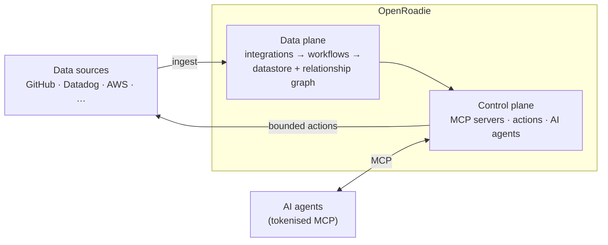

# openroadie

Open-source context store and agentic control platform. Connect your data, build guardrails, then let your agents run wild.

---

Openroadie turns your organisational metadata about your software into a self-hosted, always-on context layer for you and your team. You can then attach and bound actions that are permissible for any agent to execute, then wrap everything in tokenised MCP servers.

Openroadie is a control center designed to curate context for any agentic task — like triaging incidents and publishing findings to Slack or turning bug tickets into PRs.

It runs locally on your machine by default, but can run in a Docker container, on VMs, or within your company infrastructure.

**Quickstart**

You can install **openroadie** to run on any machine: on your laptop, on a dedicated computer like a Mac Mini, or on a server in the cloud.

The most powerful way to run **openroadie** is on a server in the cloud. This allows data ingestion to continue running even when your laptop is shut, and makes it easier to trigger your agents through third-party services like Slack, GitHub, and Datadog. See the self-hosting guide for details, especially with respect to security hardening.

**Install**

Full walk-through: [Getting started with openroadie](./docs/getting-started.md).

**openroadie** runs from source — there is no published container image or npm package.

**From Source**

**Warning**

This runs **openroadie** directly on the machine you're installing on.

**Prerequisites**: Node.js 22.12.x or later, `yarn`, `uv` (for running the agent server via `uvx`)

```
git clone https://github.com/RoadieHQ/openroadie.git openroadie
cd openroadie
docker run -d --name openroadie-dev-db -p 5432:5432 -e POSTGRES_HOST_AUTH_METHOD=trust postgres:16
yarn install
yarn dev
```

---

Access the UI at http://localhost:3333.

Access the backend at http://localhost:7008

**Architecture**

Openroadie grew out of a long-term project inside Roadie, a Developer Portal company, which in turn was based on Spotify’s Backstage open-source Internal Developer Portal.

As such, it inherits some architectural features from those previous applications — notably Backstage's dependency-injection "New Backend System" of composable plugins.

At a glance, OpenRoadie is a single Node.js backend plus Postgres, organised around two planes:



- **Data plane** — connectors ingest metadata on a schedule into a Postgres-backed context store; a rules engine relates objects into a knowledge graph.
- **Control plane** — curated, guardrailed actions are exposed to agents through tokenised MCP servers, so every tool runs with the caller's own permissions.

See **[ARCHITECTURE.md](./ARCHITECTURE.md)** for the full breakdown, with layered diagrams of the runtime, backend composition, and both planes.

**Sharing a setup**

A working configuration — data sources, relationship rules, context groups, capabilities — can be exported as a directory of YAML manifests and imported into another environment:

```
yarn workspace @roadiehq/openroadie-cli build
node packages/openroadie-cli/bin/openroadie.js bundle export -o ./my-bundle
node packages/openroadie-cli/bin/openroadie.js bundle import ./my-bundle --dry-run
```

**Conventions & Coding Standards**

See `CONTRIBUTING.md` for guidelines on how to contribute to this project.
